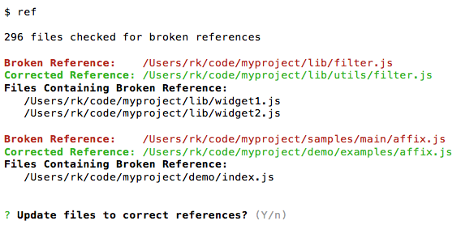
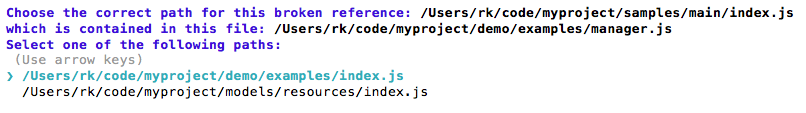

# reffix

**Reference Fixer** -- the easy fix for broken file path references. Analyze and batch-repair broken references across an entire project from the command line.

## Features

- Fixes broken `require` and `import` statements in JavaScript files
- Fixes broken `src` and `href` attributes in HTML files
- Customizable to support other types of references
- Expands references you type into your files
- Generates detailed reports about all the file path dependencies in a project
- Comprehensive filtering options
- Extremely fast asynchronous performance

## Install

`npm install --global reffix`

## Command Line Usage

`$ ref`  
or  
`$ reffix`  

Fixing broken references couldn't be easier. By default, **reffix** will generate a report of broken module references (`require` and `import` statements) by recursing through all the files in the directory in which it is launched. Use the `-m html` option to parse HTML files instead. **reffix** will list the broken and corrected paths and prompt you to update the files to fix them. Just hit `Enter` to make the repairs. All reports list absolute paths, but relative paths will be used to update the files.



If git version control is available for the files being parsed, **reffix** will use data from git status to fix references broken when files were renamed or moved. If git is unavailable, the program can repair references broken as a result of files being moved but not as a result of files being renamed. If a broken reference refers to a filename that is shared by mutliple files in different locations, reffix may not be able to determine which path to use and will prompt you to select the correct one.



 Using the command-line options described below, you can generate reports showing which files contain references and which files they refer to. You can filter the parsed files via command line options or configuration settings in a `.reffixrc` configuration file. Edit the configuration file to add support for additional types of file path references.
 
## Path Expansion
 
When you type a reference into your code but don't know offhand the full path of the relevant file, use **reffix** to automatically expand the filename into a full-path reference.

Type this into your code:  
 `'./myFile.js'`  
Run **reffix** and you'll see this when you reload the file:  
`'../../full/path/of/myFile.js'`.

## Command Line Options

### General Usage

`ref [options] [--] [working_directory]`

Each option has a short (`-o`) and a long (`--option`) version that you can use interchangeably. Short options can be combined into a single argument (for example, `-ste`). `working_directory` is the starting path to use for parsing files. It defaults to the directory from which the command is executed. If `working_directory` is preceded by option arguments, it must be immediately preceded by `--`.

### Error Correction

- `-e --errors` - List broken references and files containing them, then prompt to fix the errors. This option is engaged by default if none of the reporting options below are engaged.
- `-m --mode` - The type of references to work with. Specify the argument `default` to parse `import` and `require` statements in JavaScript files. Specify `html` to parse `href` and `src` attributes in HTML files. If `-m` is omitted, the `default` mode is used.  
- `-n --no-prompts` - Fix errors without prompting (unless overridden by `-r`).
- `-r --report-only` - Don't fix errors, just show the report. (Overrides `-n`.)

### Filtering

All lists of names or globs, as described below, must be separated by commas. If a pattern contains a `*`, the pattern should be should be enclosed in quotes, or the `*` should be escaped (`\*`).

- `-d --dirs <directory_globs>` - Exclude specified directories from parsing. Provide a list of directory names or globs to exclude. The names are added to the default list of `'.*,node_modules,build'`.
- `-f --files <source_globs> [target_globs]` - Filter the files that are analyzed and repaired. Provide a glob or list of globs to specify the source (referencing) and target (referenced) files that should be included or excluded. For example, `'!*Spec.js,*.js'`. Overrides the default filter, which is `'*.js,*.jsx' '*.*'`. `source_globs` is required. If you wish to filter only target files, enter `''` for `source_globs`.
- `-c --config <filepath>` - Load a custom configuration file located at the specified path. This can specify more-advanced parsing options (see below).

### Reporting

When one of the following switches is set, you won't be prompted to repair files unless you include `-e`. 

- `-s --sources` - List files that contain (are sources of) references.
- `-t --targets` - List files that are referenced by (targets of) other files.

### Help

- `-V --version` - Displays the software version.
- `-h --help` - Produces the following display.
```
-h, --help                                 output usage information
-V, --version                              output the version number
-c, --config <filepath>                    path of custom configuration file
-m, --mode <default|html>                  type of references to look for, JS import/require (default) or HTML href/src (html)
-f, --files <source_globs> [target_globs]  filter the source (referencing) and target (referenced) files parsed (e.g., '*1.js,*2.js' 'file.js')
-d, --dirs <directory_globs>               exclude from sources the specified directories (e.g., 'test,bin')
-e, --errors                               list broken references and prompt to fix them
-s, --sources                              list files (sources of references) containing references to other files
-t, --targets                              list files (targets of references) referenced by other files
-n, --no-prompts                           fix broken references without prompting (unless -r)
-r, --report-only                          don't fix broken references, just display reports
```

## Examples

`$ ref`  
List all broken references and prompt you to fix them.

`$ ref ../`  
Begin parsing in the parent directory and list all broken references and prompt you to fix them.

`$ ref -ret -d 'test' -f '!*Test.js,!*Spec.js'`  
Don't repair files, list errors and all references (targets), and filter out test files and directories.

`$ ref -n -f '' '**/examples/*Widget.*,**/examples/*Module.*' -- ../src`  
Repair files without prompting. Fix only references to widgets and modules in `examples` directory. Set the working directory to `../src`.

## Customization

### Configuration File

You can also specify filtering and parsing options by creating a `.reffixrc` file. Place it in your `$home` or `/etc` directory, or specify its path using the command-line option `-c --config`. The file will be merged into the following default settings and must use the same JSON format. You can add as many modes as you want and select them from the command line using the `-m` switch. Each new mode will be merged with `default`, so you need only include the properties you wish to overrride.

```javascript
{
  "default": {
    "workingDirectory": ".",
    "directoriesToExclude": [
      ".*",
      "node_modules",
      "build"
    ],
    "referencingFileFilter": [
      "*.js",
      "*.jsx"
    ],
    "referencedFileFilter": [
      "*.*"
    ],
    "searchPatterns": [
      "(^|\\s)import\\s+([\\w\\-\\{\\}\\,\\*\\$\\s]+\\s+)?(['\"]){{valuePattern}}\\3",
      "(^|[^\\w-])require *\\( *(['\"]){{valuePattern}}\\2 *\\)"
    ],
    "valuePattern": "\\.+/[^'\"]+",
    "currentDirectoryPrefix": "./",
    "textToExclude": [
      "// *[^\\n]+\\n",
      "/\\*[\\s\\S]+?\\*/"
    ]
  },
  "html": {
    "referencingFileFilter": [
      "*.html",
      "*.js"
    ],
    "referencedFileFilter": [
      "*.*"
    ],
    "searchPatterns": [
      "<link +[^>]*href=(['\"]){{valuePattern}}\\1[^>]*>",
      "<a +[^>]*href=(['\"]){{valuePattern}}\\1[^>]*>",
      "<script +[^>]*src=(['\"]){{valuePattern}}\\1[^>]*>",
      "]*src=(['\"]){{valuePattern}}\\1[^>]*>"
    ],
    "valuePattern": "[^'\":;#]+",
    "currentDirectoryPrefix": "",
    "textToExclude": [
      "<!--[\\s\\S]+?-->"
    ]
  }
}
```

#### Configuration Options

Many of the options in the configuration file are equivalent to command-line options.

- `workingDirectory` - Same as the `[working_directory]` argument on the command line.
- `directoriesToExclude` - Same as command-line `--dirs`.
- `referencingFileFilter` - Same as the `<source_globs>` argument for the command-line `--files` option.
- `referencedFileFilter` - Same as the `[target_globs]` argument for the command-line `--files` option.
- `searchPatterns` - An array of regular expression strings used to find references. The `{{valuePattern}}` variable represents the file path to be validated.
- `valuePattern` - A regular expression string to replace the `{{valuePattern}}` variable in `searchPatterns`.
- `currentDirectoryPrefix` - A prefix (such as `./`) to add at the beginning of a path to represent that it is in the current working directory.
- `textToExclude` - An array of regular expression strings specifying text (such as comments) to exclude from parsing.

#### Sample Configuration File

Adding the following to a `.reffixrc` file will exclude all `test` and `qa` directories from parsing, and it will allow you to use the command-line option `-m myMode` to search for only `*.jsx` files that reference `*.js` files through an `import` statement.

```javascript
{
  "default": {
    "directoriesToExclude": [
      ".*",
      "node_modules",
      "build",
      "test",
      "qa"
    ],
  },
  "myMode": {
    "referencingFileFilter": [
      "*.jsx"
    ],
    "referencedFileFilter": [
      "*.js"
    ],
    "searchPatterns": [
      "(^|\\s)import\\s+([\\w\\-\\{\\}\\,\\*\\$\\s]+\\s+)?(['\"]){{valuePattern}}\\3",
    ]
  }
}
```

### Windows

This software has not yet been tested on Windows.

### License

[MIT](LICENSE)  
Copyright (c) 2016 [Robert Kendall](http://robertkendall.com)